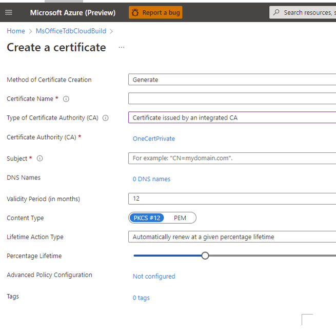

# Using certificate to authenticate to Windows Store Partner Center

## Prerequisites
You must have an Azure Active Directory (AAD) and owner access of it. See [setup.md](setup.md) for details. You also need to have access to a SAW (secure admin workstation) machine. See [New SAW Guide](https://microsoft.sharepoint.com/sites/Security_Tools_Services/SitePages/SAS/SAW%20KB/New-SAW-Guide.aspx?xsdata=MDV8MDJ8fGFmODE0MjZkMzUwMjRmYTk2ZWI5MDhkYzNmOTY3MWU0fDcyZjk4OGJmODZmMTQxYWY5MWFiMmQ3Y2QwMTFkYjQ3fDB8MHw2Mzg0NTUxNjI1NjgyMDgwNTd8VW5rbm93bnxWR1ZoYlhOVFpXTjFjbWwwZVZObGNuWnBZMlY4ZXlKV0lqb2lNQzR3TGpBd01EQWlMQ0pRSWpvaVYybHVNeklpTENKQlRpSTZJazkwYUdWeUlpd2lWMVFpT2pFeGZRPT18MXxMMk5vWVhSekx6RTVPamhqT1RVMFltSTRMV0V5TlRFdE5EY3dNUzA0TXpBeExXSXdNMlV6TlRVM1kyWXpObDg1Wm1ZMU1qWXpOUzA1TkRKbUxUUm1aamd0T1dWaU55MWhNVE5rT0Raa01UUTNaRFZBZFc1eExtZGliQzV6Y0dGalpYTXZiV1Z6YzJGblpYTXZNVGN3T1RreE9UUTFOVGcwTVE9PXxhYTVlZTYyMTY4NTY0Y2NjNmViOTA4ZGMzZjk2NzFlNHxiYjdmMzgyZDc4MDk0OWRlOTRhNWZjZWU1YzFmZDZjMg%3D%3D&sdata=YUltMm5HdGhsSFRjZmloTlIxaElqUmsyNStxQ052UG1razJadlQ3SFpCRT0%3D&ovuser=72f988bf-86f1-41af-91ab-2d7cd011db47%2Cmaarisme%40microsoft.com&OR=Teams-HL&CT=1711074123346&clickparams=eyJBcHBOYW1lIjoiVGVhbXMtRGVza3RvcCIsIkFwcFZlcnNpb24iOiI0OS8yNDAzMTQxNDcwNiIsIkhhc0ZlZGVyYXRlZFVzZXIiOmZhbHNlfQ%3D%3D) and [First Time User Login Guide](https://strikecommunity.azurewebsites.net/articles/6706/first-time-user-login-guide.html).

## Step 1: Register a domain in OneCert for your AAD application

1. Using credentials from the AAD tenant in which the AAD Application resides, go to aka.ms/onecert (on a SAW)
2. Domain Registrations -> Register New Domain
3. Fill out the form as follows:
    1. **Domain Name** - This should be the Guid representing the authentication app that you want certificates to authenticate against. You can re-use the app from v1 or v2.
    2. **Cloud** - Public
    3. **Environment** - Select the environment of your Azure Subscription Id.
    4. **Service Tree Id**: This should be the Guid of the service tree associated with the service.
    5. **Issuer (v1)**: None
    6. **Public Issuer (v2)**: None
    7. **Private Issuer (v2)**: AME
    8. **Subscription Id**: This should be the ID of the Azure Subscription(s) where the KeyVault (s) being used to host the certificates will reside. You can have multiple subscriptions listed here if you plan on having multiple KeyVaults.
    9. **Cloud Settings**: None
    10. **Owners**: The aliases of appropriate owners for the domain registration. Note: You must use an aliases from production, such as your Torus account. e.g. prdtrs01\richwhi_debug
4. Click Create Domain Registration

## Create a KeyVault (for generating & renewing the certificate)
Please ensure that the Azure subscription matches the Domain Registration subscription ID above if one does not already exist.

## Step 3: Generate a certificate
1. Navigate to the KeyVault and click on Certificates menu
2. Click on Certificate Authorities
3. Click Add to create a Certificate Authority
4. Give it a name (e.g., OneCertPrivate), choose OneCertV2-PrivateCA as the Provider, and click Create
5. Return to the Certificates menu and click Generate/Import
6. Fill out the form as follows:
    1. Certificate Name: Give the certificate a meaningful friendly name
    2. Type of Certificate Authority (CA): Choose Certificate issued by an integrated CA
    3. Certificate Authority (CA): Select the Certificate Authority created in previous step
    4. Subject: CN=<Guid of the AAD Application Id>, e.g. CN=b883a6b6-f875-43c2-bf69-ce20f6bc2a44
    5. Content Type: Select pem, so later on you can download the pem content and add the pem content to the service connection.
    6. Lifetime Action Type: Ensure it's set to renew at a percentage lifetime
    7. Percentage Liftetime: Set to 24
    8. Click Create </br>

    

## Step 4: Configure the AAD application to accept appropriate certificates
1. Navigate to the AAD App Registration page of the AAD Application you are configuring
2. First, ensure that there are no existing certificates configured for the AAD application. Remove any Subject Name and Issuer (SNI) based certificates.
3. Next, click on the Manifest menu
4. Add a collection of trustedCertificateSubjects to the end of the JSON content displayed on screen (replace the Guid in the subjectName with the Guid of the AAD application). The authorityId is for AME private issuer, which was specified in step 1.

    

5. Click Save (Refresh the page to ensure that the change is now reflected in the Manifest)

## Step 5: Create a new service connection using certificate
1. Go to project settings -> Service Connection click on “New Service Connection”. Select Azure Resource Manager, and then select Service Principal (Manual) for authentication method. 
2. Fill in the service principal ID and tenant ID with the client ID and tenant of your Azure AD application.
3. For credential, click on “Certificate”. You need to get the content of the .pem file from the certificate you created in previous stage. Simply go to your keyvault and download the certificate there. Make sure to click on “Download in PFX/PEM format”.
4. If you have an Azure subscription in the same tenant as your service principal, then you can fill in the subscription ID and subscription Name with those of your Azure subscription. It's not mandatory for you to provide the subscription ID and subscription name in order to run the Windows Store extension. You can simply provide any value for subscription ID and subscription name as shown in the screenshot above, and do "save without verification" to create the service connection. To save without doing any verification, you can click on the dropdown on the right of the button "verify and save".

See more information on adding Service connections on Azure DevOps [here](https://docs.microsoft.com/en-us/azure/devops/pipelines/library/service-endpoints?view=vsts).

## Step 6: Adding the Service Connection to your Pipeline
Make sure you add the service connection to your extension task in your pipeline. If you are using classic release pipeline, you can add the service connection directly using the UI. If you are maintaining a YAML pipeline, you should add the service connection to the serviceEndpoint field under inputs. E.g. 

```
- task: MS-RDX-MRO.windows-store-publish-dev.flight-task.store-flight@3
  displayName: 'Publish '
  inputs:
    serviceEndpoint: <YOUR SERVICE ENDPOINT NAME> 
    appId: XXX
    flightNameType: FlightName
    flightName: XXX
    sourceFolder: XXX
    contents: XXX
```

## Step 7: Using 1ES Secret Rotator Tool to update service connection when certificate is renewed
Since the certificate will expire at a certain time, the service connection also needs to be updated. To do this automatically, it’s recommended for you to onboard your new AAD key vault certificate to the [1ES Secret Rotator Tool](https://eng.ms/docs/experiences-devices/opg/office-es365/idc-fundamentals-security/oe-secret-rotator/secret-rotator-tool). You can follow the instructions from the documentation to deploy the secret rotator tool, which is an Azure function that executes every 30 minutes, to any Azure Resource Group and let it automatically update the service connection whenever it sees an update from your key vault certificate. Please go through the linked documentation for details on how to onboard.

Now that you have set up your extension, you can start using it in your build and release pipelines. See the [Usage](./usage.md) section for more information.
