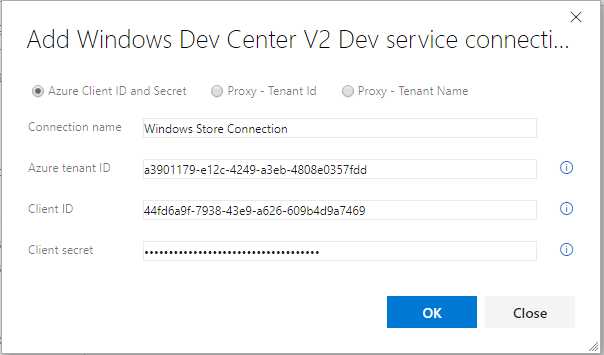

# Setup

## Quick start

1. Ensure you meet the [prerequisites](#prerequisites).

2. [Install](https://marketplace.visualstudio.com/items?itemName=MS-RDX-MRO.windows-store-publish) the extension.

3. [Obtain](#obtaining-your-credentials) and [configure](#configuring-your-credentials) your Dev Center credentials.

4. [Add tasks](#task-reference) to your release definitions.

## Prerequisites

1. Determine which major version of the extension you should use. If you are Microsoft FTE using Azure DevOps pipeline within Microsoft please use v3. If you are outside of Microsoft please use v0.

2. You must have an Azure Active Directory, and you must have [global administrator permission](https://azure.microsoft.com/en-us/documentation/articles/active-directory-assign-admin-roles/) for the directory. You can create a new Azure AD [from Dev Center](https://docs.microsoft.com/en-us/windows/uwp/publish/associate-azure-ad-with-dev-center#create-a-brand-new-azure-ad-to-associate-with-your-partner-center-account). If you already use Office 365 or other business services from Microsoft,
     you already have an AAD. Otherwise, you can
     [create a new AAD in Partner Center](https://msdn.microsoft.com/windows/uwp/publish/manage-account-users)
     for no additional charge.

3. You must [associate your AAD with your Partner Center account](https://learn.microsoft.com/en-us/windows/apps/publish/partner-center/associate-existing-azure-ad-tenant-with-partner-center-account) obtain the credentials to allow this extension to access your account and perform actions on your behalf.

4. The app you want to publish must already exist: this extension can only publish updates to existing applications. You can [create your app in Partner Center](https://msdn.microsoft.com/windows/uwp/publish/create-your-app-by-reserving-a-name).

5. You must have already [created at least one submission](https://msdn.microsoft.com/windows/uwp/publish/app-submissions) for your app before you can use the Publish task provided by this extension. If you have not created a submission, the task will fail.

6. More information and extra prerequisites specific to the API can be found [here](https://msdn.microsoft.com/windows/uwp/monetize/create-and-manage-submissions-using-windows-store-services).

## Obtaining your credentials in v3.\* tasks (For Microsoft FTEs only)

In V3 Tasks, we have added support for using [federated credentials](wifauth.md) or [certificate authentication](certificateauth.md) mechanism. You can also keep using the App secret authentication described below for v0.\* tasks. Users within Microsoft are required to use secret-less authentication method as part of our security requirement. 

## Obtaining your credentials in v0.\* tasks (For users outside of Microsoft)

### Authentication in v0.\* tasks

Your credentials are comprised of three parts: the Azure **Tenant ID**, the **Client ID** and the **Client secret**. After you [add](https://docs.microsoft.com/en-us/windows/uwp/publish/add-users-groups-and-azure-ad-applications#add-azure-ad-applications-from-your-organizations-directory) or [create](https://docs.microsoft.com/en-us/windows/uwp/publish/add-users-groups-and-azure-ad-applications#create-a-new-azure-ad-application-account-in-your-organizations-directory-and-add-it-to-your-partner-center-account) an Azure AD application, you can return to the Users section and select the application name to review settings for the application, including the Tenant ID, Client ID, Reply URL, and App ID URI.

### Configuring your credentials in v0\* tasks

Once you have obtained your credentials, you must configure them in VSTS so that the extension can access your Dev Center account and publish on your behalf. You must [install the extension](https://docs.microsoft.com/en-us/azure/devops/marketplace/install-vsts-extension?view=vsts) before being able to configure your credentials. Once the extension is installed, follow these steps:

1. In Azure DevOps, open the **Service connections** page from the [project settings](https://docs.microsoft.com/en-us/azure/devops/project/navigation/go-to-service-page?view=vsts#open-project-settings) page. In TFS, open the **Services** page from the "settings" icon in the top menu bar.

2. Choose **+ New service connection** and select the type of service connection you need. Two types of Service connections are offered with this extension. *Windows Dev Center*. This is required for tasks version *v0.\** and is included for backward compatibility. The rest of the article will focus on this service endpoint. For information on the previous version, see [this tag](https://github.com/Microsoft/windows-dev-center-vsts-extension/tree/v0.9.26#configuring-your-credentials).

3. In the pop-up box, there are three options to connect to the Windows Store, *Azure Client ID and Secret*, *Proxy - Tenant Id* and *Proxy - Tenant Name*. 

    * **Azure Client ID and Secret authentication**

      Select the *Azure Client ID and Secret* option. Fill in your credentials in the corresponding text boxes (**Azure Tenant ID**, **Client ID** and **Client Secret**).

      

4. Click **OK** to confirm. Your endpoint is now configured and will be accessible by the extension's tasks.

See more information on adding Service connections on Azure DevOps [here](https://docs.microsoft.com/en-us/azure/devops/pipelines/library/service-endpoints?view=vsts).

Now that you have set up your extension, you can start using it in your build and release pipelines. See the [Usage](./usage.md) section for more information.