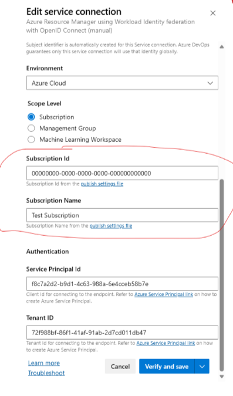

# Using federated credentials to authenticate to Windows Store Partner Center

## Prerequisites
You must have an Azure Active Directory (AAD) and owner access of it. See [setup.md](setup.md) for details.

## Creating a service connection
On Azure DevOps, create an Azure Resource Manager type service connection and select “Workload Identity Federation (Manual)” as type. You will be asked to provide the following information:

1. Subscription ID: ID of an Azure subscription used for verification step required to create the service connection.
2. Subscription Name: Name of an Azure subscriptions used for verification step required to create the service connection.
3. Service Principal ID: Azure AD client ID for accessing Partner Center API. 
4. Tenant ID: Tenant ID for Azure AD used for accessing Partner Center API. Use Microsoft tenant ID in this field. 

<br />



It's not mandatory for you to provide the subscription ID and subscription name in order to run the Windows Store extension. You can provide any value for subscription ID and subscription name as shown in the screenshot above, and do "save without verification" to create the service connection. To save without doing any verification, you can click on the dropdown on the right of the button "verify and save".

Your service connection should contain 2 additional fields called **Issuer** and **Subject Identifier**. These two fields will later be used to create federated credentials for your Azure AD application.

## Adding federated credential to your Azure AD application
Go to Azure portal and find your Azure AD application, and do the following steps.

1. Go to **Manage** > **Certificates & secrets**.
2. Select **Federated credentials**.
3. Select **Add credentials**.
4. Select the **Other issuer** scenario.
5. Enter values for **Issuer** and **Subject identifier** from those generated by your service connection.

## Adding the Service Connection to your Pipeline
Make sure you add the service connection to your extension task in your pipeline. If you are using classic release pipeline, you can add the service connection directly using the UI. If you are maintaining a YAML pipeline, you should add the service connection to the serviceEndpoint field under inputs. E.g. 

```
- task: MS-RDX-MRO.windows-store-publish-dev.flight-task.store-flight@3
  displayName: 'Publish'
  inputs:
    serviceEndpoint: <YOUR SERVICE ENDPOINT NAME> 
    appId: XXX
    flightNameType: FlightName
    flightName: XXX
    sourceFolder: XXX
    contents: XXX
```